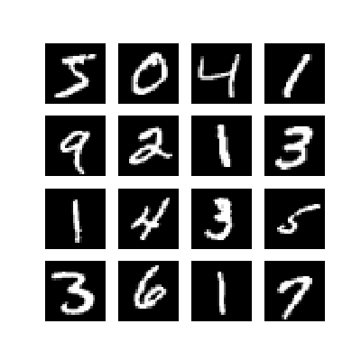
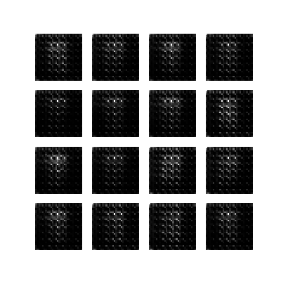
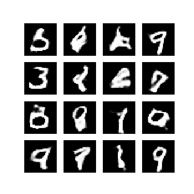

# DCGAN
## The implementation of Deep Convolutional Generative Adversarial Network (DCGAN)

This is a basic implementation of [Deep Convolutional Generative Adversarial Network (DCGAN)](https://arxiv.org/pdf/1511.06434.pdf). The code mainly refers to the [TensorFlow Tutorials](https://tensorflow.google.cn/tutorials/generative/dcgan) in [`tensorflow/docs`](https://github.com/tensorflow/docs). Two datasets mnist and Large-scale Celeb Faces Attributes ([CelebA](https://www.kaggle.com/jessicali9530/celeba-dataset)) were used.

## There are some differences in the newotk architecture that implements these two data sets

* Generator

  * mnist

    Input:(batch_size, 100)

    Dense(7\*7\*256), BatchNormalization(), LeakyReLU()

    Reshape to (7, 7, 256)

    Conv2DTranspose(128, (5, 5), strides=(1, 1), padding='same', use_bias=False), BatchNormalization(), LeakyReLU()

    Conv2DTranspose(64, (5, 5), strides=(2, 2), padding='same', use_bias=False), BatchNormalization(), LeakyReLU()

    Conv2DTranspose(1, (5, 5), strides=(2, 2), padding='same', use_bias=False, activation='tanh')

  * CelebA

    Input:(batch_size, 500)

    Dense(16\*16\*256), BatchNormalization(), LeakyReLU()

    Reshape to (16, 16, 256)

    Conv2DTranspose(128, (5, 5), strides=(1, 1), padding='same', use_bias=False), BatchNormalization(), LeakyReLU()

    Conv2DTranspose(64, (5, 5), strides=(2, 2), padding='same', use_bias=False), BatchNormalization(), LeakyReLU()

    Conv2DTranspose(32, (5, 5), strides=(2, 2), padding='same', use_bias=False), BatchNormalization(), LeakyReLU()

    Conv2DTranspose(3, (5, 5), strides=(2, 2), padding='same', use_bias=False, activation='tanh')

* Discriminator

  * mnist

    Input: (batch_size, 28, 28, 1)

    Conv2D(64, (5, 5), strides=(2, 2), padding='same'), LeakyReLU(), Dropout(0.3)

    Conv2D(128, (5, 5), strides=(2, 2), padding='same'), LeakyReLU(), Dropout(0.3)

    Flatten()

    Dense(1)

  * CelebA

    Input: (batch_size, 128, 128, 3)

    Conv2D(64, (5, 5), strides=(2, 2), padding='same'), LeakyReLU(), Dropout(0.3)

    Conv2D(128, (5, 5), strides=(2, 2), padding='same'), LeakyReLU(), Dropout(0.3)

    Conv2D(256, (5, 5), strides=(2, 2), padding='same'), LeakyReLU(), Dropout(0.3)

    Flatten()

    Dense(1)

## Visual result

### mnist

## Liscense
